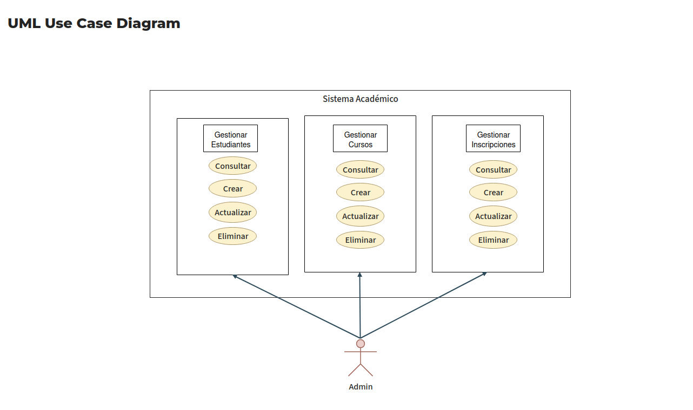
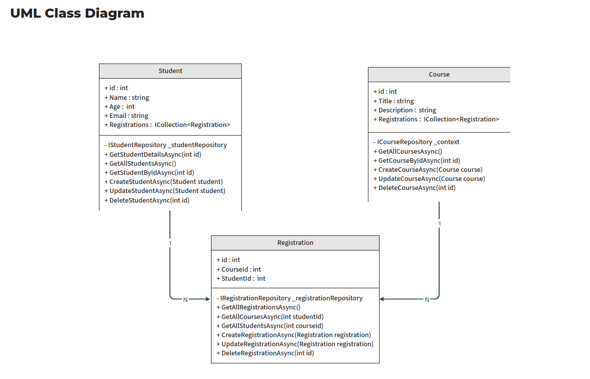

# 📚 Course Management API

Este proyecto es una aplicación **ASP.NET Core Web API** desarrollada en C# con arquitectura en capas, diseñada para la gestión de cursos.  
Incluye capas separadas para dominio, aplicación, infraestructura y API.

---

## 🚀 Características principales

- Arquitectura limpia (Domain, Application, Infrastructure, API)
- Soporte para Entity Framework Core
- Configuración para entornos de desarrollo y producción
- API REST con controladores para operaciones CRUD
- Integración con base de datos (según configuración en `appsettings.json`)

---

## 🧰 Requisitos previos

Antes de ejecutar el proyecto, asegúrate de tener instalado:

- [.NET SDK 8.0 o superior](https://dotnet.microsoft.com/en-us/download)
- [Git](https://git-scm.com/)
- Un editor compatible (recomendado: [Visual Studio 2022](https://visualstudio.microsoft.com/) o [Rider](https://www.jetbrains.com/rider/))

---

## 📦 Instalación y ejecución

## 1️⃣ Clonar el repositorio
```bash
git clone https://github.com/Sarahorianna2006/Gestion_cursos.git
cd courseManagement
```

---

## 3️⃣ Compilar la solución
```bash
dotnet build
```

---

## 4️⃣ Ejecutar la API
```bash
cd apiWeb.Api
dotnet run
```
Por defecto, la API estará disponible en:
```arduino
https://localhost:5001
http://localhost:5000
```

---

## ⚙️ Configuración
Los archivos de configuración se encuentran en:

- apiWeb.Api/appsettings.json → Configuración general (base de datos, JWT, etc.)

- apiWeb.Api/appsettings.Development.json → Configuración para entorno de desarrollo

Puedes ajustar la cadena de conexión a tu base de datos antes de ejecutar la API.

Ejemplo:
```json
"ConnectionStrings": {
  "DefaultConnection": "Server=localhost;Database=CourseDB;User=root;Password=1234"
}
```

---

## 🧪 Comandos útiles

| Comando | Descripción |
|----------|-------------|
| `dotnet restore` | Restaura los paquetes NuGet |
| `dotnet build` | Compila la solución |
| `dotnet run` | Ejecuta la API |
| `dotnet test` | Ejecuta las pruebas (si existen) |
| `dotnet ef migrations add <Nombre>` | Crea una nueva migración |
| `dotnet ef database update` | Actualiza la base de datos con las migraciones |
| `dotnet clean` | Limpia los archivos de compilaciones previas |

---
 ## 🧩 Configuración de la base de datos (Entity Framework)
Si tu proyecto usa Entity Framework Core, sigue estos pasos para preparar la base de datos:
```bash
# Instalar herramientas EF (si no las tienes)
dotnet tool install --global dotnet-ef

# Crear una nueva migración
dotnet ef migrations add InitialCreate --project apiWeb.Infrastructure --startup-project apiWeb.Api

# Aplicar migraciones a la base de datos
dotnet ef database update --project apiWeb.Infrastructure --startup-project apiWeb.Api
```

---

## 📂 Estructura del proyecto
```
courseManagement/
│
├── apiWeb.Api
│ ├── Controllers
│ │ ├── CourseController.cs
│ │ ├── RegistrationController.cs
│ │ └── StudentController.cs
│ │
│ ├── appsettings.json
│ ├── appsettings.Development.json
│ └── Program.cs
│
├── apiWeb.Application
│ ├── DTOs
│ │ ├── CourseDto.cs
│ │ ├── RegistrationCreateDto.cs
│ │ ├── RegistrationDetailsDto.cs
│ │ ├── RegistrationDto.cs
│ │ ├── StudentDetailsDto.cs
│ │ └── StudentDto.cs
│ │
│ └── Services
│ ├── CourseService.cs
│ ├── RegistrationService.cs
│ └── StudentService.cs
│
├── apiWeb.Domain
│ ├── Interfaces
│ │ ├── ICourseRepository.cs
│ │ ├── IRegistrationRepository.cs
│ │ └── IStudentRepository.cs
│ │
│ └── Models
│ ├── Course.cs
│ ├── Registration.cs
│ └── Student.cs
│
└── apiWeb.Infrastructure
├── Data
│ └── AppDbContext.cs
│
└── Repository
├── CourseRepository.cs
├── RegistrationRepository.cs
└── StudentRepository.cs
```

---

## 🏗️ Estructura por capas

El proyecto sigue el patrón de **Clean Architecture**, dividiendo responsabilidades en cuatro capas principales:

| Capa | Descripción |
|------|--------------|
| **Domain** | Contiene las entidades del negocio y las interfaces base. |
| **Application** | Contiene la lógica de aplicación, servicios y DTOs. |
| **Infrastructure** | Implementa la persistencia de datos, contextos y repositorios. |
| **API** | Expone los endpoints HTTP, configuración e inyección de dependencias. |

---

## 📬 Endpoints principales

A continuación se listan los endpoints disponibles en la API:

### 📘 Course
| Método | Endpoint | Descripción |
|---------|-----------|-------------|
| GET | `/api/Course` | Obtiene todos los cursos |
| POST | `/api/Course` | Crea un nuevo curso |
| GET | `/api/Course/{id}` | Obtiene un curso por su ID |
| PUT | `/api/Course/{id}` | Actualiza un curso existente |
| DELETE | `/api/Course/{id}` | Elimina un curso por su ID |

---

### 🧾 Registration
| Método | Endpoint | Descripción |
|---------|-----------|-------------|
| GET | `/Registration` | Obtiene todas las inscripciones |
| POST | `/Registration` | Crea una nueva inscripción |
| GET | `/Registration/student/{studentId}` | Obtiene las inscripciones de un estudiante específico |
| GET | `/Registration/course/{courseId}` | Obtiene las inscripciones de un curso específico |
| PUT | `/Registration/{id}` | Actualiza una inscripción existente |
| DELETE | `/Registration/{id}` | Elimina una inscripción por su ID |

---

### 🎓 Student
| Método | Endpoint | Descripción |
|---------|-----------|-------------|
| GET | `/api/Student` | Obtiene todos los estudiantes |
| POST | `/api/Student` | Crea un nuevo estudiante |
| GET | `/api/Student/{id}` | Obtiene un estudiante por su ID |
| PUT | `/api/Student/{id}` | Actualiza un estudiante existente |
| DELETE | `/api/Student/{id}` | Elimina un estudiante por su ID |

---

## Diagramas

### Diagrama Caso de Uso



### Diagrama de Clases

